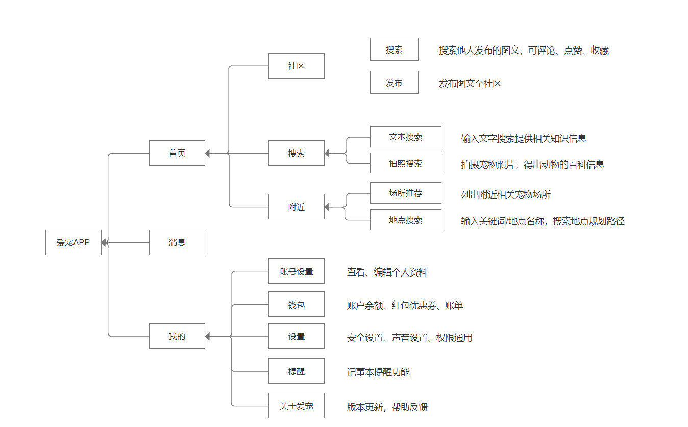
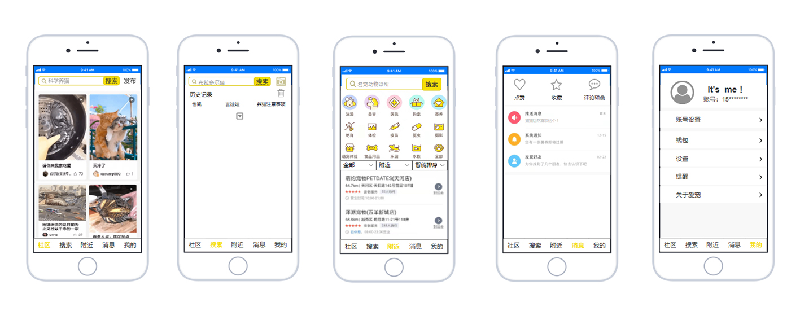
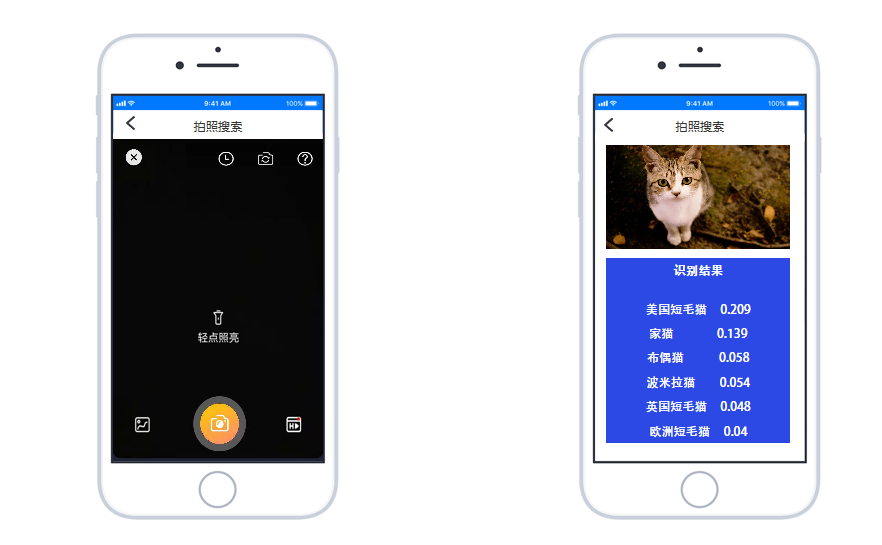
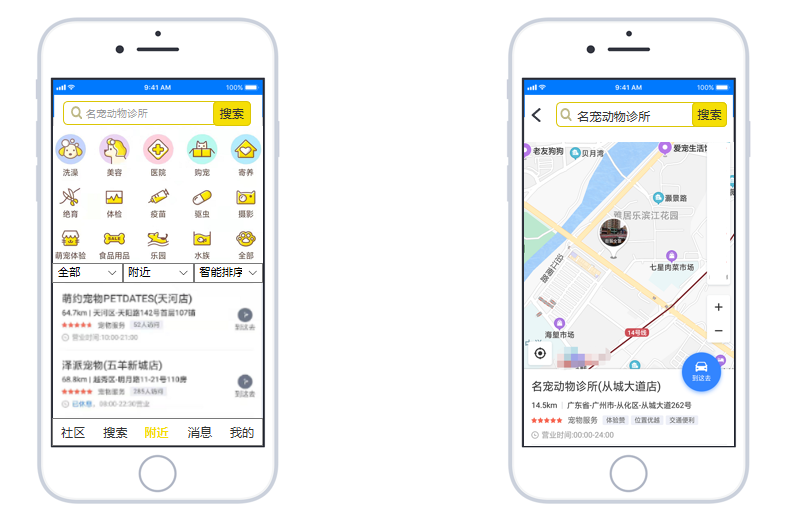
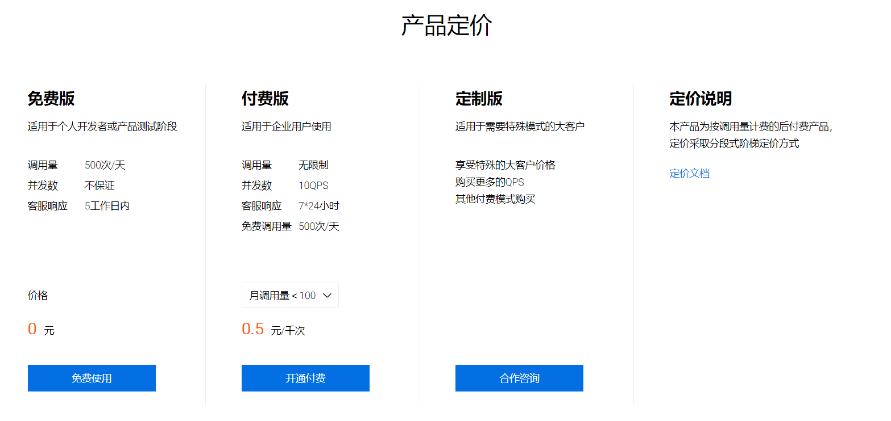
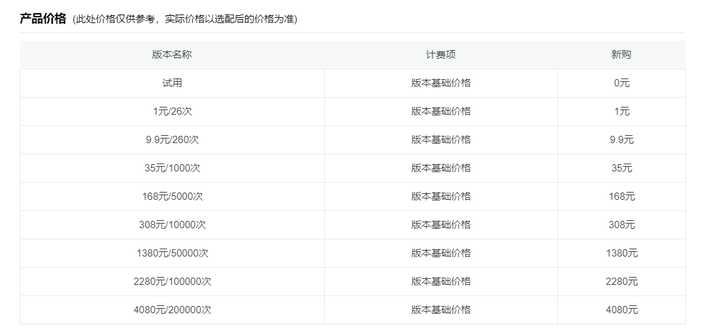

# 项目名称：宠物管家 ———— 爱宠APP

| Title | Content |
| --- | --- |
|项目名称|爱宠APP|
|项目负责人|陈熙|
|学号|171013009|
|文档状态| 已完成|

# 价值主张设计
### 一句话版本
- 本产品为宠物管家APP，为用户饲养宠物提供帮助，满足宠物主人饲养宠物的日常需求，从而使宠物获得更舒适的生活。

### 一分钟版本
- 本产品为宠物管家APP，通过调用动物识别API和地图API，主打拍照/图片搜索宠物类别及相关信息，推荐、搜索宠物场所的功能，帮助宠物主人了解以及护理爱宠，满足宠物主人饲养宠物的日常需求，从而使宠物获得更舒适的生活。
## 背景
随着经济的发展，人们对精神层面的追求越来越高，越来越多的人开始饲养宠物，人们饲养宠物成为精神、生活伴侣。近年来宠物经济火爆，各市场领域规模激增，人们对宠物以及宠物周边服务的需求在持续不断增长着，但是宠物饲养趋势不断攀升，市面上的宠物app仍就不多，还处于探索阶段。
## 产品定位
“PET”是一款宠物管家软件，旨在于帮助宠物主人了解以及护理爱宠。
## 产品功能
- 识别宠物类型
- 附近宠物医院/宠物中心
- 社区交流养宠心得
- 提醒对爱宠进行护理
## 加值宣言
- 百度动物识别
识别近八千种动物，接口返回动物名称，并获取百科信息
- 高德地图api
多种搜索方式，高德提供了千万级别的POI，通过POI搜索，可以完成找宠物医院、找宠物中心等等的功能
## 核心价值
-  动物识别：拍照／上传宠物图片，检测该图片，返回识别结果的百科信息。
- 高德地图api：搜索出附近相关宠物地点，并规划出路线。
## 用户痛点
- 用户不了解爱宠习性和宠物护理，很难系统地收集到宠物信息
- 宠物异常行动现象会让大多数用户感到很可恼，无从下手
- 用户找不到一款合适的宠物软件
## 用户需求		
| 用户案例| 对应接口|   重要程度|
| --- | --- |--- |
| 用户希望了解爱宠品种和习性| 动物识别|重要|
| 用户想要知道附近的宠物医院/宠物中心及路径| 高德地图|  特别重要|
| 用户希望可以有一个平台发布爱宠动态，并且与他人交流养宠新心得|    | 重要|
##### 具体运用场景：
- 场景一：用户a捡了一只流浪猫，他想知道这只猫的品种，于是打开识别功能，通过上传这只猫的图片，得到这只猫的品种信息
- 场景二：用户b的爱宠生病了，他想知道附近的宠物医院及路径，于是打开搜索功能，得到了附近宠物医院的信息和地图路径
## 产品目标
###### 前期：
- 识别宠物品种及相关信息
- 地图搜索
- 通过投放宠物用品广告，实现盈利
###### 后期：
- 建立宠物交流社区
- 上线商城功能和上门服务，增加产品盈利
## 人工智能概率性
- 动物识别成功率受图片清晰度、光线等客观因素影响。当图片模糊、光线不佳，或者是图片上的动物存在遮挡物，都会降低动物识别成功率，导致识别失败。
- 被识别图片中动物种类多，会降低识别结果的准确度。
- 收到网络信号，或者信号干扰，会导致无法正常使用APP的功能。

# 原型
## 产品架构图

## 产品原型
1. 基本页面

2. 拍照搜索

3.文本搜索

4.附近搜索

## 原型文档
- 点击查看产品原型          [爱宠APP产品原型](https://heeya-pol.github.io/aichong_axure/)
- 跳转至原型文档下载入口     [爱宠APP产品原型下载区](https://github.com/HEEya-pol/aichong_axure)
# API的使用
### 使用水平：输入请求代码，返回响应结果
#### 代码过长放入Gitee仓库，点击查看[百度动物识别API](https://gitee.com/ALYFUxixi/apiapi_final_code/blob/master/%E6%8B%8D%E7%85%A7%E6%90%9C%E7%B4%A2.md)
[高德地图API](https://gitee.com/ALYFUxixi/apiapi_final_code/blob/master/%E9%99%84%E8%BF%91%E5%9C%BA%E6%89%80%E4%BB%A3%E7%A0%81.md)
#### 1.百度图像识别（一种：动物识别）
###### 接口描述：
识别近八千种动物，接口返回动物名称，支持获取识别结果的百科信息，接口返回百科词条URL、图片和描述，支持自定义返回词条数
###### 请求地址：https://aip.baidubce.com/rest/2.0/image-classify/v1/animal
###### 服务示例：
#### 代码过长放入gitee仓库，点击查看[代码入口](https://gitee.com/ALYFUxixi/apiapi_final_code/blob/master/%E6%8B%8D%E7%85%A7%E6%90%9C%E7%B4%A2.md)
#### 2. 高德地图API（三种：周边搜索、关键词搜索、路径规划）：
###### 接口描述：
对于地图的搜索，搜索行为和结果主要是与地理位置相关的，搜索结果一般都直接展现在地图图面上
###### 请求地址：https://restapi.amap.com/v3/place/around?parameters
###### 服务示例：
- 代码过长放入gitee仓库，点击查看
[代码入口](https://gitee.com/ALYFUxixi/apiapi_final_code/blob/master/%E9%99%84%E8%BF%91%E5%9C%BA%E6%89%80%E4%BB%A3%E7%A0%81.md)
### API比较分析
#### 一、动物识别
| | 百度动物识别| 阿里云【图像识别OCR】动物识别 |
|--|--|--|
|请求格式支持| PNG、JPG、JPEG、BMP、GIF**|.png, .jpg, .jpeg, .bmp|
|产品功能|1.识别近八千种动物，接口返回动物名称； 2.支持自定义返回结果数支持获取识别结果的百科信息，接口返回百科词条URL、图片和描述，支持自定义返回词条数|1.支持识别图片动物信息；2.包括动物名称或类型；3.识别准确率高达90%以上；4.可对URL网络图片或base64信息进行识别。
|产品定价|||
|成熟度|⭐ ⭐ ⭐ ⭐ ⭐  | ⭐ ⭐ ⭐ ⭐  |
|性价比| ⭐ ⭐ ⭐ ⭐  | ⭐ ⭐ ⭐  |
#### 二、地图API
| | 百度地图API | 高德地图API |
|--|--|--|
|产品功能|1.识别近八千种动物，接口返回动物名称； 2.支持自定义返回结果数支持获取识别结果的百科信息，接口返回百科词条URL、图片和描述，支持自定义返回词条数|1.支持识别图片动物信息；2.包括动物名称或类型；3.识别准确率高达90%以上；4.可对URL网络图片或base64信息进行识别。
|产品定价|[百度地图API定价规则](http://lbsyun.baidu.com/apiconsole/record)|[高德地图定价规则](https://lbs.amap.com/home/package?active=quota)|
|成熟度|⭐ ⭐ ⭐ ⭐  |⭐ ⭐ ⭐ ⭐ ⭐  |
|性价比| ⭐ ⭐ ⭐  |⭐ ⭐ ⭐ ⭐   |

## 清单
- 产品原型          [爱宠APP产品原型](https://heeya-pol.github.io/aichong_axure/)
- 原型文档下载入口     [爱宠APP产品原型下载区](https://github.com/HEEya-pol/aichong_axure)
- [百度AI动物识别调用代码入口](https://gitee.com/ALYFUxixi/apiapi_final_code/blob/master/%E6%8B%8D%E7%85%A7%E6%90%9C%E7%B4%A2.md)
- [高德地图API调用代码入口](https://gitee.com/ALYFUxixi/apiapi_final_code/blob/master/%E9%99%84%E8%BF%91%E5%9C%BA%E6%89%80%E4%BB%A3%E7%A0%81.md)
- [百度动物识别](https://ai.baidu.com/tech/imagerecognition/animal)
- [动物识别技术文档](https://ai.baidu.com/ai-doc/IMAGERECOGNITION/Zk3bcxdfr)
- [高德地图API](https://lbs.amap.com/)
- [高德地图API产品文档](https://lbs.amap.com/api/webservice/gettingstarted)
